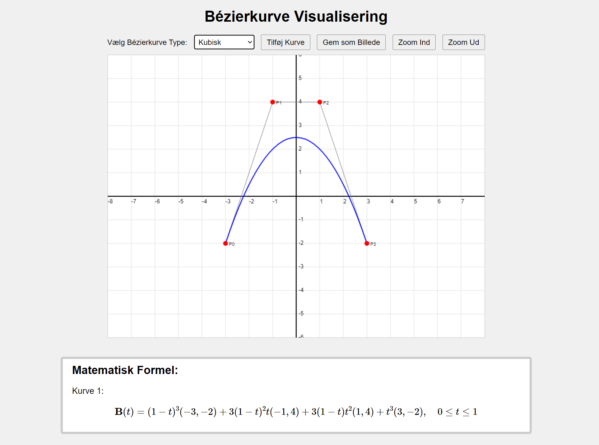

# Bezier-kurve-Visualisering



[Link til Demo](https://zenkhalil.github.io/Bezier-kurve-Visualisering/)

## Introduktion

**Bezier-kurve-Visualisering** er et interaktivt webbaseret værktøj designet til at hjælpe brugere med at tegne, visualisere og manipulere Bezier-kurver og splines på en HTML5 `<canvas>`. 

## Funktioner

- **Tegning af Bezier-kurver**: Understøtter lineære, kvadratiske og kubiske Bezier-kurver, hvilket giver fleksibilitet til at skabe forskellige former og kompleksiteter.

- **Bezier Spline**: Mulighed for at oprette og redigere komplekse Bezier-splines bestående af flere sammenhængende kubiske kurver.

- **Interaktiv Manipulation**: Brugere kan nemt trække og slippe kontrolpunkter for at ændre kurvernes form i realtid.

- **Grid og Snapping**: Et baggrundsgrid hjælper med præcis placering af kontrolpunkter med en snap-funktionalitet, der sikrer nøjagtighed.

- **Zoom-funktioner**: Tilbyder mulighed for at zoome ind og ud for bedre kontrol over tegneområdet og detaljeniveauet.

- **Formelgenerering**: Automatisk generering af LaTeX-formler, der beskriver de aktuelle kurver, hvilket er nyttigt til dokumentation og præsentation.

- **Eksport**: Gem canvas som et billede (`.png`) for nem deling og videre brug.

- **Responsive Design**: Canvas tilpasser sig automatisk til skærmstørrelsen, hvilket sikrer en optimal brugeroplevelse på forskellige enheder.

## Teknologier

Projektet er bygget ved hjælp af følgende teknologier:

- **HTML5**: Struktur og layout af applikationen.
- **CSS3**: Styling af brugergrænsefladen for en moderne og intuitiv brugeroplevelse.
- **JavaScript (ES6)**: Implementering af funktionalitet, interaktivitet og klasse-baseret programmering.
- **MathJax**: Rendering af LaTeX-formler for at vise de matematiske beskrivelser af kurverne.
- **Git**: Versionskontrol og samarbejde via GitHub.

## Filstruktur

Projektet er opdelt i fire hovedfiler for at opnå bedre organisering og vedligeholdelse:

1. **`bezierClasses.js`**
   - Indeholder klasse-definitionerne for `BezierCurve` og `BezierSpline`.
   - Inkluderer hjælpefunktionen `formatNumber` til formatering af tal.

2. **`drawing.js`**
   - Indeholder alle tegnefunktionerne, der håndterer rendering af forskellige elementer på canvas.
   - Funktioner inkluderer:
     - `drawGrid()`: Tegner baggrundsgridet.
     - `drawAxes()`: Tegner X- og Y-akser med labels.
     - `drawControlPoints()`: Tegner kontrolpunkter og deres labels.
     - `drawControlLines()`: Tegner linjer mellem kontrolpunkter.
     - `drawSpline()`: Tegner den samlede Bezier-spline.

3. **`main.js`**
   - Håndterer initialisering af applikationen.
   - Definerer konstanter og globale variabler.
   - Indeholder funktioner til at tilføje nye kurver og opdatere canvas.
   - Håndterer zoom-funktioner og canvas-resizing.

4. **`events.js`**
   - Indeholder alle event-håndteringsfunktioner.
   - Funktioner inkluderer:
     - Musens `mousedown`, `mousemove`, `mouseup` og `mouseleave` events for træk og slip af kontrolpunkter.
     - Knapklik for at tilføje kurver, zoome ind/ud og gemme canvas.
     - Mouse wheel event til zoom via scroll.

## Installation

Følg disse trin for at køre projektet lokalt:

1. **Clone repositoryet**:
    ```bash
    git clone https://github.com/ZenKhalil/Bezier-kurve-Visualisering.git
    ```
2. **Naviger til projektmappen**:
    ```bash
    cd Bezier-kurve-Visualisering
    ```
3. **Åbn `index.html` i din foretrukne webbrowser**:
    - Dobbeltklik på `index.html` filen eller brug en lokal server for bedre support af ES6-moduler.

## Brug

1. **Vælg Kurvetype**:
   - Brug dropdown-menuen til at vælge mellem `Lineærr`, `Kvadratisk`, `Kubisk` eller `Bézier Spline`.

2. **Tegn og Rediger Kurver**:
   - Klik og træk kontrolpunkter for at ændre kurvernes form.
   - Tilføj nye kurver ved at klikke på "Add Curve" knappen (når en enkelt kurvetype er valgt).

3. **Zoom**:
   - Brug "Zoom In" og "Zoom Out" knapperne eller musens scroll for at ændre zoomniveauet.

4. **Gem Canvas**:
   - Klik på "Save" knappen for at eksportere det aktuelle canvas som et PNG-billede.

5. **Formelgenerering**:
   - LaTeX-formler for de aktuelle kurver vises automatisk under canvas. Sørg for, at MathJax er korrekt indlæst for at se formlerne.


## Inspirationskilder

- **Bézier curves (Coding Challenge 163)**: [https://www.youtube.com/watch?v=enNfb6p3j_g](https://www.youtube.com/watch?v=enNfb6p3j_g)
- **Bezier Curves Explained**: [https://www.youtube.com/watch?v=pnYccz1Ha34](https://www.youtube.com/watch?v=pnYccz1Ha34)
- **The Beauty of Bézier Curves**: [https://www.youtube.com/watch?v=aVwxzDHniEw](https://www.youtube.com/watch?v=aVwxzDHniEw)
- [Wikipedia: Bézier curve](https://en.wikipedia.org/wiki/B%C3%A9zier_curve)
- [Bezier Spline Continuity](https://www.csc.kth.se/~weinkauf/notes/beziersplinecontinuity.html)
- [Splines from Scratch: Bezier Curves](https://dev.to/ndesmic/splines-from-scratch-bezier-curves-1c1m)
- [JavaScript.info: Bezier curve](https://javascript.info/bezier-curve)
